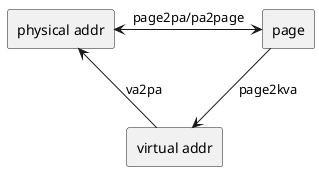
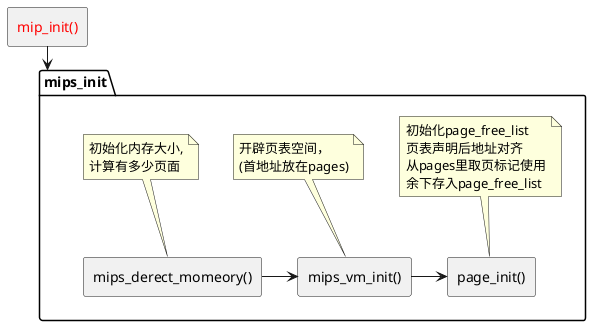
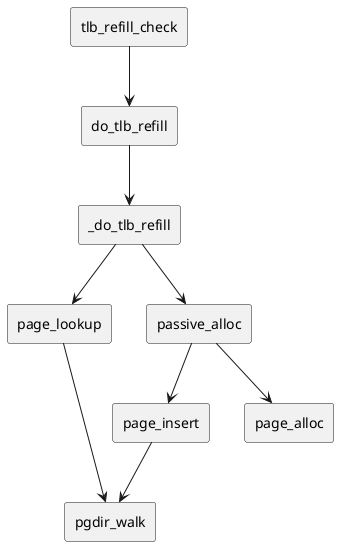

# lab2 report

## 思考题

### Think2.1

#### Q: 在编写的 C 程序中，指针变量中存储的地址是虚拟地址，还是物理地址？MIPS 汇编程序中 lw 和 sw 使用的是虚拟地址，还是物理地址？

C程序中，指针变量储存的地址是虚拟地址，MIPS汇编中lw, sw使用的也是虚拟地址

### Think2.2

#### Q1: 从可重用性的角度，阐述用宏来实现链表的好处

增加代码复用性，减少编写量和出错可能，增加了可读性

#### Q2: 查看实验环境中的/usr/include/sys/queue.h，了解其中单向链表与循环链表的实现，比较它们与本实验中使用的双向链表，分析三者在插入与删除操作上的性能差异

- 该头文件下有两种单项链表，差别在于是否记录尾指针。单向链表只有头节点插入、节点后插入（、尾节点后插入）的实现，复杂度都是O(1)。但是节点前插入和删除需要从head遍历获取前项节点，复杂度是O(n)
- 同样的，循环链表也有两种，单向循环链表和双向循环链表，单向循环链表和单向链表一致，在节点后插入、头尾节点后插入的复杂度O(1)，删除和节点前插入复杂度O(n); 但是双向循环链表，在节点前插入和删除不需要查找，效率是O(1)，其它部分一致
- 实验中中使用的双向链表在删除，节点前后插入以及头节点后插入时不需要遍历，复杂度是O(1)，但是尾节点后插入需要遍历链表查找尾节点，复杂度是O(n)

### Think2.3

#### Q:  将 Page_list 的结构梳理清楚，选择正确的展开结构

选C

```c
struct Page_list {
    struct {
        struct {
            struct Page *le_next;
            struct Page **le_prev;
        } pp_link;
        u_short pp_ref;
    } *lh_first;
}
```

### Think2.4

#### Q1: 从虚拟内存的实现角度，阐述 ASID 的必要性

操作系统会给每个进程分配自己的虚拟地址空间，而同一个虚拟地址空间在不同进程中应该映射到不同的物理空间(除非共享)，而`asid`字段就是用来区分不同进程的。如果没有它，可能会引起虚拟地址到物理地址的映射错误

#### Q2: 结合 ASID段的位数，说明 R3000 中可容纳不同的地址空间的最大数量

`asid`在`EntryHi`寄存器中占6位，也就是说可以标识64个不同进程，R3000 中可容纳不同的地址空间的最大数量就是64

### Think2.5

#### Q1: tlb_invalidate 和 tlb_out 的调用关系

`tlb_invlidate`调用`tlb_out`

#### Q2: 请用一句话概括 tlb_invalidate 的作用

获取页表对应`EntryHi`寄存器值并传给`tlb_out`进行清除

#### Q3: 逐行解释 tlb_out 中的汇编代码

```c
LEAF(tlb_out)
.set noreorder
    mfc0    t0, CP0_ENTRYHI     # 获取CP0_ENTRYHI寄存器值
    mtc0    a0, CP0_ENTRYHI     # 更新CP0_ENTRYHI寄存器值为传入参数
    nop
    tlbp                        # 根据EntryHi在TLB中查找与之对应的表项，并把表项的索引存入Index寄存器
    nop
    mfc0    t1, CP0_INDEX       # 获取新页面的页表项索引
.set reorder
    bltz    t1, NO_SUCH_ENTRY   # 如果对应的新页表项没找到就套转到return部分
.set noreorder
    mtc0    zero, CP0_ENTRYHI   # 找到对应页表项，将CP0_ENTRYHI赋值0
    mtc0    zero, CP0_ENTRYLO0  # 将CP0_ENTRYLO0赋值0
    nop
    tlbwi                       # 将EntryHi和EntryLo0寄存器中的值存取Index对应的TLB表项中，也就是将现在Index指向页面清楚
.set reorder

NO_SUCH_ENTRY:
    mtc0    t0, CP0_ENTRYHI     # 恢复CP0_ENTRYHI值
    j       ra                  # 返回tlb_invalidate
END(tlb_out)
```

### Think2.6

#### Q1: 简单了解并叙述 X86 体系结构中的内存管理机制，比较 X86 和 MIPS 在内存管理上的区别

- X86架构采用段页式内存管理，其地址分为逻辑地址、线性地址、物理地址，而MIPS主要是页式内存管理，没有线性地址
- 内存映射机制不同，X86的逻辑地址包含 段选择器 + 偏移，其线性地址包含 页目录偏移 + 页表偏移 + 页内偏移，寻址大致如下


&emsp;&emsp;而MIPS通过两级页表转换就从虚拟地址映射到物理地址

- 缺页异常应对不同，MIPS会触发TLB Refill异常，内核的TLB回填获取当前进程的页目录基址，索引获得转换失败的虚址对应的页表项目，并将其填入TLB，然后CPU再重新执行异常指令，重新访问那个TLB。X86在TLB不命中时，是由硬件MMU以CR3为当前进程的页目录基址，索引获得物理页框号后，直接输出其对应物理地址。同时MMU会填充TLB以加快下次转换的速度。

#### Q2: 简单了解并叙述 RISC-V 中的内存管理机制，比较 RISC-V 与 MIPS 在内存管理上的区别

RISC-V提供三种权限模式（MSU），而MIPS只提供内核态和用户态两种权限状态。RISC-V SV39支持39位虚拟内存空间，每一页占用4KB，使用三级页表访存。

### ThinkA.1

#### Q1: 三级页表页目录的基地址

通过PT~base~ 可以知道其虚拟页号为 PT~base~>>12, 映射到其的二级页表虚拟地址为 PT~2~ = PT~base~ + (P~base~>>12)*8 = PT~base~ | PT~base~>>9, 同理，一级页表(页表目录)的虚拟地址为 PD = PT~2~ + (P~2~>>12)*8 = PT~2~ | PT~2~>>9 = PT~base~ | PT~base~>>9 | PT~base~>>18

#### Q2: 映射到页目录自身的页目录项（自映射）

一级页表偏移位置(PD>>12)*8
自映射表项在PD | (PD>>12)*8 = PT~base~ | PT~base~>>9 | PT~base~>>18 | PT~base~>>27

## 实验难点

本次实验困难之处在于厘清思路，要清楚每部分在干嘛

### 地址间的变换

对于一个数据块，有三个地址和它相关，而在编写代码时，使用的是虚拟地址



对于lab2，(启动部分)kseg0的虚实地址转换可以使用添0抹0的宏函数`PADDR, KADDR`
`page`在代码中表现为`struct Page`，而`physical addr`存在页表项中，`virtual addr`没有具体表现

对于这三种地址标记的理解：
`page`变量的作用是标记页面引用次数，而代码中访问数据是通过`vittual addr`实现的，底层上是通过`physical addr`寻址的

### lab2主线思路

第一大主线就是建立页(链)表



另一条测试主线(据我看源码。箭头指调用)



可见`pgdir_walk`的重要性，然而这个函数也是难点，这个难点还是体现在对虚实地址页表项理解不深刻：

1. pgdir_entryp页目录基址寻址，寻址后需要判定页目录项是否有效(即`PTE_V`位是否为1)
2. pgdir_entryp高二十位是物理地址，需要先用`PTE_ADDR`取址后通过`KADDR`转化为虚拟地址才是代码可访问的页表项地址

## 体会和感想

lab2的基础知识没掌握好，导致想三个地址关系想了很久，其次就是对库里面有哪些取址转换函数不甚了解，直接导致了我多次阅读源码，填写函数花费时间十分长，致使本次实验花了好几天
这次实验，至少让我对两级页表地址映射有了不可磨灭的印象
