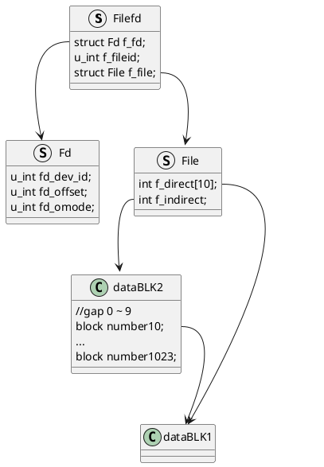

# lab5

## 思考题

### Think5.1 如果通过 kseg0 读写设备，那么对于设备的写入会缓存到 Cache 中。这是一种错误的行为，在实际编写代码的时候这么做会引发不可预知的问题。请思考：这么做这会引发什么问题？对于不同种类的设备（如我们提到的串口设备和 IDE 磁盘）的操作会有差异吗？可以从缓存的性质和缓存更新的策略来考虑

当外部设备产生中断信号或者更新数据时，此时Cache中之前旧的数据可能刚完成缓存，但是完成缓存的这一部分无法完成更新，则会发生错误的行为。

对于串口设备来说，读写频繁，信号多，在相同的时间内发生错误的概论远高于IDE磁盘。

### Think5.2 查找代码中的相关定义，试回答一个磁盘块中最多能存储多少个文件控制块？一个目录下最多能有多少个文件？我们的文件系统支持的单个文件最大为多大？

FILE2BLK = BY2BLK / sizeof(struct File) = 4096 / 256 = 16个
一个`struct File`指向1024个block number，所以目录下最多1024 * 16 = 16384个文件
每个文件最大 1024 * 4096 = 4 MB

## Thinking 5.3 请思考，在满足磁盘块缓存的设计的前提下，我们实验使用的内核支持的最大磁盘大小是多少？ 

DISKMAX = 1GB

## Thinking 5.4 在本实验中，fs/serv.h、user/include/fs.h 等文件中出现了许多宏定义，试列举你认为较为重要的宏定义，同时进行解释，并描述其主要应用之处

```c
#define FILEBASE 0x60000000 //文件基址，向下是fd存储空间，向上是文件内容存储空间，在INDEX2DATA中用于将编号对应到虚拟空间
#define FDTABLE (FILEBASE - PDMAP) // fd起始地址，在INDEX2FD中用于将编号对应fd结构体

/* Disk block n, when in memory, is mapped into the file system
 * server's address space at DISKMAP+(n*BY2BLK). */
#define DISKMAP 0x10000000//文件映射起始地址，磁盘缓冲区，创建镜像时将内容缓存到这里

/* Maximum disk size we can handle (1GB) */
#define DISKMAX 0x40000000//允许最大磁盘区域

struct File {
	char f_name[MAXNAMELEN]; // filename
	uint32_t f_size;	 // file size in bytes
	uint32_t f_type;	 // file type
	uint32_t f_direct[NDIRECT]; //前NDIRECT个disk编号
	uint32_t f_indirect; //指向一个存着拓展编号的disk的编号

	struct File *f_dir; // the pointer to the dir where this file is in, valid only in memory.
	char f_pad[BY2FILE - MAXNAMELEN - (3 + NDIRECT) * 4 - sizeof(void *)];
} __attribute__((aligned(4), packed));

// file descriptor
struct Fd {
	u_int fd_dev_id; //外设号
	u_int fd_offset; //偏移量
	u_int fd_omode;  //打开方式
};

// file descriptor + file
struct Filefd {
	struct Fd f_fd; //文件描述
	u_int f_fileid; //文件编号
	struct File f_file; //文件控制块
};
```

## Thinking 5.5 在 Lab4“系统调用与 fork”的实验中我们实现了极为重要的 fork 函数。那么 fork 前后的父子进程是否会共享文件描述符和定位指针呢？请在完成上述练习的基础上编写一个程序进行验证

会


子进程能通过父进程的fd编号找到文件镜像并且由于Exercise5.10（4）增加的偏移量导致其读取到空串

## Thinking 5.6 请解释 File, Fd, Filefd 结构体及其各个域的作用。比如各个结构体会在哪些过程中被使用，是否对应磁盘上的物理实体还是单纯的内存数据等。说明形式自定，要求简洁明了，可大致勾勒出文件系统数据结构与物理实体的对应关系与设计框架

`struct File`用于建立文件镜像，记录镜像中的文件信息以及文件服务中查找文件等

```c
struct File {
	char f_name[MAXNAMELEN]; //文件名
	uint32_t f_size;	 // 文件大小
	uint32_t f_type;	 // 文件类型
	uint32_t f_direct[NDIRECT]; //前NDIRECT个disk编号
	uint32_t f_indirect; //指向一个存着拓展编号的disk的编号

	struct File *f_dir; // 指向上级文件夹
	char f_pad[BY2FILE - MAXNAMELEN - (3 + NDIRECT) * 4 - sizeof(void *)];// 对齐
} __attribute__((aligned(4), packed));
```

Fd和Filefd在文件服务中打开生成，Fd用于操作文件内容（读写等），Filefd将几个信息联系起来

```c
// file descriptor
struct Fd {
	u_int fd_dev_id; //外设号
	u_int fd_offset; //偏移量
	u_int fd_omode;  //打开方式
};

// file descriptor + file
struct Filefd {
	struct Fd f_fd; //文件描述
	u_int f_fileid; //文件编号
	struct File f_file; //文件控制块
};
```

## Thinking 5.7 图5.7中有多种不同形式的箭头，请解释这些不同箭头的差别，并思考我们的操作系统是如何实现对应类型的进程间通信的

同步消息，用黑三角箭头搭配黑实线表示。同步的意义：消息的发送者把进程控制传递给消息的接收者，然后暂停活动，等待消息接收者的回应消息。

返回消息，用开三角箭头搭配黑色虚线表示。返回消息和同步消息结合使用，因为异步消息不进行等待，所以不需要知道返回值。

mos系统中， ipc_recv 设置状态为接收后阻塞自身直到 ipc_send 给它信息，文件系统对于每个操作都有不同的 fsreq ，统一通过fsipc发给服务进程，服务进程处理后再发信返回，服务进程本身是一个循环，每个周期不断地recv阻塞自己知道接受到信息进行操作。

## 实验难点

### 数据之间对应关系




### 调用关系

```puml
skinparam componentStyle rectangle
package fd{
    [close_all] --> [close]
    [readn] --> [read]
    [write]
    [stat] --> [fstat]
    [seek]
}
package file{
    [file_close]
    [file_read]
    [file_write]
    [file_stat]
    [open]
    [ftruncate]
    [remove]
    [sync]
    [read_map]
}
package fsipc{
    [fsipc_dirty]
    [fsipc_close]
    [fsipc_open]
    [fsipc_map]
    [fsipc_set_size]
    [fsipc_remove]
    [fsipc_sync]

}
package serve{
    [serve_dirty]
    [serve_close]
    [serve_open]
    [serve_map]
    [serve_get_size]
    [serve_remove]
    [serve_sync]
}

package fs{
    [file_dirty]
    [void file_close]
    [file_open]
    [file_get_block]
    [file_set_size]
    [file_remove]
    [fs_sync]
}

[close] --> [file_close]
[read] --> [file_read]
[write] --> [file_write]
[fstat] --> [file_stat]
[file_close] --> [fsipc_dirty]
[fsipc_close] .right.> [fsipc_dirty]
[file_close] --> [fsipc_close]
[open] --> [fsipc_open]
[fsipc_open] .right.> [fsipc_map]
[open] --> [fsipc_map]
[ftruncate] --> [fsipc_set_size]
[remove] --> [fsipc_remove]
[sync] --> [fsipc_sync]
[fsipc_dirty] --> [serve_dirty]
[serve_dirty] --> [file_dirty]
[fsipc_close] --> [serve_close]
[serve_close] --> [void file_close]
[fsipc_open] --> [serve_open]
[serve_open] --> [file_open]
[fsipc_map] --> [serve_map]
[serve_map] --> [file_get_block]
[fsipc_set_size] --> [serve_get_size]
[serve_get_size] --> [file_set_size]
[fsipc_remove] --> [serve_remove]
[serve_remove] --> [file_remove]
[fsipc_sync] --> [serve_sync]
[serve_sync] --> [fs_sync]
```

## 实验感想

代码填写易，理解起来极其复杂，主要是过多的结构体引入，它们数据存放地方，排布规则都十分隐晦。内容也十分丰富，镜像加载、文件服务进程、底层操作函数与外设。直到现在仍然难以理解。