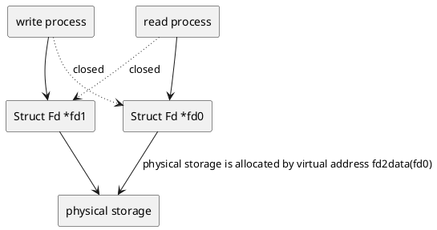
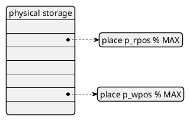

# lab6

## 思考题

### Think6.1 示例代码中，父进程操作管道的写端，子进程操作管道的读端。如果现在想让父进程作为“读者”，代码应当如何修改？

将父、子进程对应的filders交换，并交换读写函数即可

```c
case 0: /* 子进程 - 作为管道的写者 */
    close(fildes[0]); /* 关闭不用的读端 */
    write(fildes[1], "Hello world\n", 12); /* 向管道中写数据 */
    close(fildes[1]); /* 写入结束，关闭写端 */
    exit(EXIT_SUCCESS);
default: /* 父进程 - 作为管道的读者 */
    close(fildes[1]); /* 关闭不用的写端 */
    read(fildes[0], buf, 100); /* 从管道中读数据 */
    printf("father-process read:%s", buf); /* 打印读到的数据 */
    close(fildes[0]); /* 读取结束，关闭读端 */
    exit(EXIT_SUCCESS);
```

### Think6.2 上面这种不同步修改 pp_ref 而导致的进程竞争问题在 user/lib/fd.c 中的 dup 函数中也存在。请结合代码模仿上述情景，分析一下我们的 dup 函数中为什么会出现预想之外的情况？

判断关闭的实际标准是$当前读/写端的引用数目 = 管道的引用数目$，而与读/写端的引用数目加和没有关系，另一个信息是$读/写端的引用 \leq 管道引用数目$

两次增删引用数目并不是原子操作，于是从数学的角度考虑这个问题，容易发现两次操作中不能有相等的时候，就好比，不能先删除读写端对管道的映射再取消读写端的映射(不能先减大的后减小的)。同样的道理，不能先添加对读写端的映射再添加读写端对管道的映射(不能先加小的后加大的)

例子

| pageref(p[0]) | pageref(p[1]) | pageref(pipe) |

| -------------  | ------------- | ------------- |

| 1               | 1             | 2            |

先加 `pageref(p[0])`再加 `pageref(pipe)`，若中途发生中断可能导致 `pageref(p[0]) == pageref(pipe) == 2`

### Think6.3 阅读上述材料并思考：为什么系统调用一定是原子操作呢？如果你觉得不是所有的系统调用都是原子操作，请给出反例。希望能结合相关代码进行分析说明

在进入内核态时用mips汇编代码关闭了时钟中断

### Think6.4

#### Q1 按照上述说法控制 pipe_close 中 fd 和 pipe unmap 的顺序，是否可以解决上述场景的进程竞争问题？给出你的分析过程

可以解决这个问题，因为 `pageref(fd) < pageref(pipe)`，先解除对 `fd`的映射再解除 `pipe`的映射能保证中间的每个过程都是 `pageref(fd) < pageref(pipe)`，避免了冲突造成等于，误判读写端关闭

#### Q2 我们只分析了 close 时的情形，在 fd.c 中有一个 dup 函数，用于复制文件描述符。试想，如果要复制的文件描述符指向一个管道，那么是否会出现与 close 类似的问题？请模仿上述材料写写你的理解

`dup`恰好反过来，如果先将 `fd`的映射进行复制再复制 `pipe`的映射，那么在一二步之间可能存在两个引用数目相同造成关闭误判。

### Think6.5 认真回看 Lab5 文件系统相关代码，弄清打开文件的过程; 回顾 Lab1 与 Lab3，思考如何读取并加载 ELF 文件; 在 Lab1 中我们介绍了 data text bss 段及它们的含义，data 段存放初始化过的全局变量，bss 段存放未初始化的全局变量。关于 memsize 和 filesize ，我们在 Note1.3.4中也解释了它们的含义与特点。关于 Note 1.3.4，注意其中关于“bss 段并不在文件中占数据”表述的含义。回顾 Lab3 并思考：elf_load_seg() 和 load_icode_mapper()函数是如何确保加载 ELF 文件时，bss 段数据被正确加载进虚拟内存空间。bss 段在 ELF 中并不占空间，但 ELF 加载进内存后，bss 段的数据占据了空间，并且初始值都是 0。请回顾 elf_load_seg() 和 load_icode_mapper() 的实现，思考这一点是如何实现的？

`user/lib/files.c`文件中的 `open`函数调用同文件夹下的 `fsipc_open`函数,`fsipc_ open`通过调用 `fsipc`函数向服务进程进行进程间通信，并接收返回的消息。文件系统服务进程接到通信后使用 `serve_open`函数调用 `file_open`对文件进行打开操作，最终通过进程间通信实现与用户进程对 `fd number`的共享。

lab1 和 lba3 中，我们通过kern/env.c中的 `load_icode`实现ELF文件的加载，该函数使用 `elf_from`检查ELF幻数，然后用 `elf_load_seg`将对应的程序头加载到内存中，最后设置elf文件程序入口地址

`elf_load_seg`函数会将 `.bss`段通过 `map_page`建立虚拟内存到物理内存的映射，但不从文件加载数据而是代为使用 `load_icode_mapper`作为回调函数

`load_icode_mapper`将 `.bss`某页清0并使用 `page_insert`函数将其与虚拟内存建立映射

### Think6.6 通过阅读代码空白段的注释我们知道，将标准输入或输出定向到文件，需要我们将其 dup 到 0 或 1 号文件描述符（fd）。那么问题来了：在哪步，0 和 1 被“安排”为标准输入和标准输出？请分析代码执行流程，给出答案

在shell启动初始化时，`user/init.c`的 `main`函数中有如下片段

```c
// stdin should be 0, because no file descriptors are open yet
if ((r = opencons()) != 0) {
    user_panic("opencons: %d", r);
}
// stdout
if ((r = dup(0, 1)) < 0) {
    user_panic("dup: %d", r);
}
```

调用 `opencons`时系统内没开过其他文件，所以该函数申请得到的文件描述符编号是0，而 `dup`中新申请了一个文件描述符编号为1的文件，并将其与终端文件建立映射

### Think6.7 在 shell 中执行的命令分为内置命令和外部命令。在执行内置命令时 shell 不需要 fork 一个子 shell，如 Linux 系统中的 cd 命令。在执行外部命令时 shell 需要 fork一个子 shell，然后子 shell 去执行这条命令。据此判断，在 MOS 中我们用到的 shell 命令是内置命令还是外部命令？请思考为什么Linux 的 cd 命令是内部命令而不是外部命令？

MOS系统的shell命令是外部命令，应为解析和执行指令时都进行了 `fork()`

查找资料可知，cd指令会改变工作路径，若将其做成外部指令，则会在 `fork()`的子shell中改变工作路径，对当前shell(父进程)没有返回也没有效果。而且事实上，cd指令确实是shell的一个内置函数而没有做成一个可执行文件

### Think6.8 在你的 shell 中输入命令 ls.b | cat.b > motd

#### Q1 请问你可以在你的 shell 中观察到几次 spawn？分别对应哪个进程？

可以观察到2次spawn，分别对应 2803 spawn 3805(ls指令执行进程)和 3004 spawn 4006(cat指令执行进程)

#### Q2 请问你可以在你的 shell 中观察到几次进程销毁？分别对应哪个进程？

可以观察到4次进程销毁，分别对应3805(ls指令执行进程)、4006(cat指令执行进程)、3004(递归的右边命令解析shell)、2803(子shell进程)四个进程

### 实验重点

实验包含管道的实现和shell的实现两部分。

管道是两个文件描述符号指向一块实际内存



而物理内存(或者说文件)被设计为一个环形缓冲区



下标指向之处就是即将 读写 的位置，所以，读写位置不可重合，对应读写终止条件分别为 `rpos < wpos` 和 `wpos - rpos < MAX`都不可取等于(我习惯性后者取等导致废了不少事)

shell实现是通过用户程序 `user/sh.c`实现的，对于每个字符串输入，在 `main`中fork一个shell进程调用 `runcmd`，`runcmd`调用 `parsecmd`对重定向和管道进行解析，返回解析结果后进行执行

重定向解析只是简单的打开了一个新的文件，然后将对应的标准输出(0或者1)通过 `dup`建立映射，而对于管道连接符 `|`需要创建一个新管道替掉原有管道，并调用 fork 分出一个执行命令的 Shell 进程递归调用parsecmd 实现对右半部分的解析，当前进程解析了左半进程即进行返回。

### 感想

本次实验对底层函数逻辑要求较少，完成时间较前几次大大减短，理解其主干也相对容易，难以理解的还是 `pageref`的冲突，指导书没有明面指出上文中的引用结构，需要自己根据描述和代码进行揣测

至此OS课程也将告一段落，实验代码其实未能完全理解。比如，最底层的，代码中如何从虚拟地址找到物理地址和判定权限位就不甚明白。~~课设代码在物理和虚拟地址区分这块确实有待改进~~

